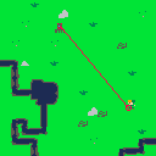
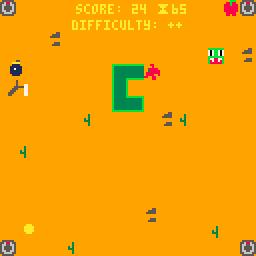

# pico8
Prototypes, GFX, levels, completed games... a mix of everything I do in Pico-8.

## Zelda BOTW Guardian (GFX)

Playable here: https://www.lexaloffle.com/bbs/?tid=34827

Tried to replicate the guardian's laser attack animation from Zelda Breath of the Wild.

I had a lot of fun doing this! Things I have learnt/done:

- You can rotate any function you want making it a cartesian curve and applying sines. Used for creating the strands growing in the guardian at the beginning of its attack.
- Making a very, very simple gfx system and making any variable as a parameter for the effect helped me to smooth the effect trying several timings and compositions.

Things I should have done or were hard:

- Sprite art is hard!
- GFX is bound to framerate instead of time

## Snek (Game)

Playable here: https://www.lexaloffle.com/bbs/?tid=34828

Simple classic Snake game with a little twist adding turrets shooting at you and powerups to help speeding up the game.

Things I have learnt/done:

- Having a clear flow of events happening is pretty important for future-proofing your game. It makes it easier to implement new features during development. For example, I had some problems implementing the tongue powerup because I assumed if the snake head was in the same position as the apple, the latter would be eaten.
- Inner workings of Pico-8: sprite drawing, coordinates, tables, local and global variables, gameflow (init, update, draw)...

